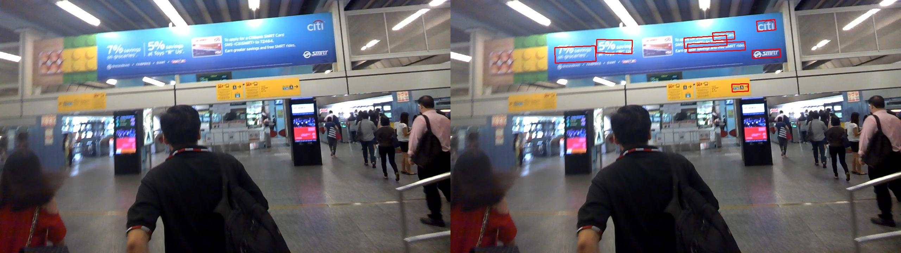
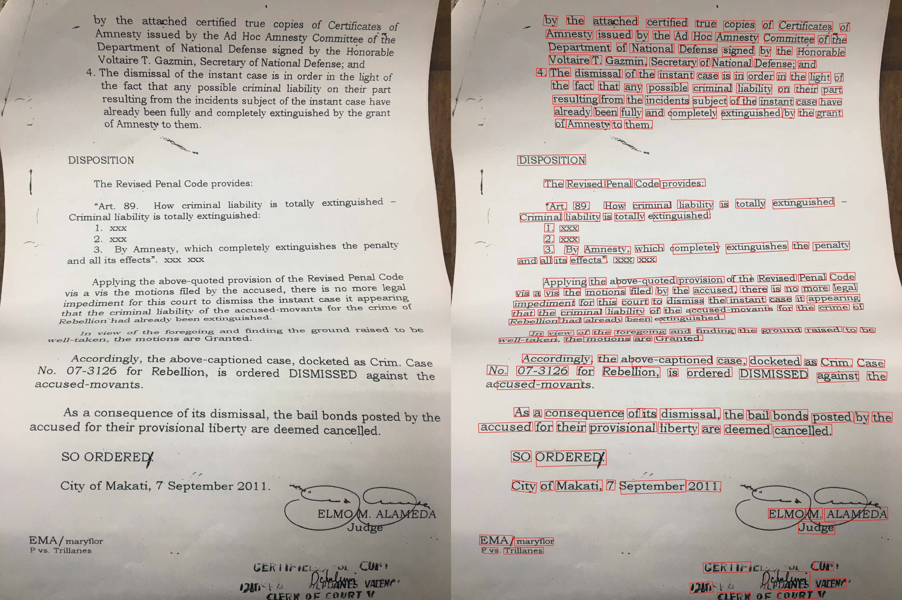

# Receptive Field Blocks Text Detection Module (RFBTD Module)
A Dense Text Detection model using Receptive Field Blocks

### Introduction
This repo contains text detection based on [Receptive Field Blocks](https://arxiv.org/abs/1711.07767). The text detection model provides a dense receptive field, for predicting text boxes in dense natural scene images like documents, articles etc.

The model is also inspired from [EAST: An Efficient and Accurate Scene Text Detector](https://arxiv.org/abs/1704.03155v2), where the **RRBOX** part and loss function is taken from.

The features of the model are summarized below:
+ Keras implementation for lucid and clean code.
+ Backbone: **Resnet50**
+ Inference time for 720p images:

    **GPU VERSION**
    + Graphics Card: MX130
    + Inference Time: 700ms
    + Batch Size: 1
   
    **CPU VERSION**
    + CPU: Intel i7-8550U CPU @ 1.80GHz
    + Inference Time: 1750ms
    + Batch Size: 1

+ The pre-trained model provided achieves **47.09**(Single Crop, Resize Only) F1-score on ICDAR 2015, but was not trained on ICDAR 2015. To improve accuracy fine-tune on ICDAR 2015, and predict with multiple crops.

+ The model is tuned for predicting text boxes for natural scene documents, like bank statements, forms, recipts, etc, and evidently do OCR on these text boxes.


Please cite these [paper](https://arxiv.org/abs/1711.07767), [paper](https://arxiv.org/abs/1704.03155v2) if you find this useful.

### Contents
1. [Live Demo](#livedemo)
2. [Installation](#installation)
3. [Download Pre-Trained Model](#download)
4. [Demo](#demo)
5. [Eval](#eval)
6. [Train](#train)
7. [Examples](#examples)

### LiveDemo
The model is hosted on my server so if you want to try it out live, [click here](https://ai.pragmaticdnn.in/rfb-text-detection) and the model is hosted with the resolution resized to **@480p**. This is due to the model not fiting on my single core, 512mb RAM server. So accuracy will flounder due to the small image input.

### Installation
+ Requirements from requirements.txt

     tensorflow==1.13.1

     Keras==2.2.4
     
     numpy==1.16.2
     
     opencv_contrib_python==4.0.0.21
     
     plumbum==1.6.7

### Download
The **Pre-trained Model** is available at this Link [GoogleDrive](https://drive.google.com/open?id=1mw8v_VV1KidyrqY_0A_oSYxRhPex4oKY)

### Demo
If you've downloaded the pre-trained model, run 
```
python3 run_demo.py
```
the images are taken from **test_images/input_images** and the output is predicted to **test_images/predicted_images**

### Eval
If you want to benchmark it on ICDAR 2015, run 
```
python eval.py
```
the images are taken from **eval_images/evaluation_images** and the output is predicted to **eval_images/predicted_boxes**, text files will be then written to the output path. This format confides to the ICDAR text detection challenge format.

### Train
The training code is not uploaded as of now, but will definitely post it in the upcoming days.  

### Examples
Here are some examples, the images on the left represent source images, and the images on the right are images overlayed with the predicted bounding boxes.






### Issues
If you encounter any issues, please create an issue tracker.

### Model Architecture

If you want to get more insight on the RF Block, just peruse the model architecture.


And a huge shout out for [argman/EAST](https://github.com/argman/EAST) for providing C++ NMS. 
